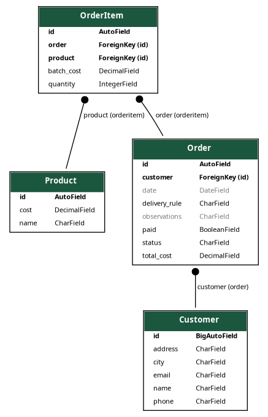

# Django Backend Deployment Guide

This guide provides step-by-step instructions to deploy the Django backend for your project.

## Prerequisites

Before deploying the Django backend, ensure that you have the following prerequisites installed:

- Python (version X.X.X)
- Django (version X.X.X)
- Other project dependencies listed in requirements.txt

## Deployment Steps

Follow these steps to deploy the Django backend:


1. Create and activate a virtual environment:
   ```bash
   python -m venv env
   source env/bin/activate  # Unix/Linux
   .\env\Scripts\activate  # Windows
   ```

2. Install project dependencies:
   ```bash
   pip install -r requirements.txt
   ```

3. Perform necessary configuration: 
   - Set up the database in your settings.py file:
     ```python
     DATABASES = {
         'default': {
             'ENGINE': 'django.db.backends.postgresql',
             'NAME': 'your_database_name',
             'USER': 'your_username',
             'PASSWORD': 'your_password',
             'HOST': 'your_host',
             'PORT': 'your_port',
         }
     }
     ```

   - Configure other settings as required (e.g., static files, email settings, etc.).

   Since we are using MySQLite this part is not necessary

4. Apply database migrations:
   ```bash
   python manage.py migrate
   ```

5. Load initial data (if applicable):
   ```bash
   python manage.py loaddata business/fixtures/fixture.json
   ```
   **Important**
   > When loading the data comment the file `business/signals.py`, this is because it interfiers with the loading data but on a real scenario it is usefull

6. Run the Django development server:
   ```bash
   python manage.py runserver
   ```

7. Access the backend API at `http://localhost:8000/`

## Entity Relationship (ER) Diagram



## Using Signals

The project utilizes Django signals to perform certain actions when specific events occur. For example, a signal can be used to update related models or trigger additional actions when a particular model is saved, deleted, etc.

To use signals, follow these steps:

1. Create a `signals.py` file in your app directory.

2. Define signal receivers as needed. For example:
   ```python
   from django.db.models.signals import post_save
   from django.dispatch import receiver
   from your_app.models import YourModel

   @receiver(post_save, sender=YourModel)
   def your_model_post_save(sender, instance, **kwargs):
       # Perform actions upon saving YourModel
       pass
   ```

3. Import the `signals.py` file in your app's `apps.py` file:
   ```python
   from django.apps import AppConfig

   class YourAppConfig(AppConfig):
       default_auto_field = 'django.db.models.BigAutoField'
       name = 'your_app'

       def ready(self):
           import your_app.signals  # Import signals module
   ```

4. Django will automatically register the signal receivers when the app is loaded.

## Using Different Serializers for /pedido/ Endpoint

The `/pedido/` endpoint of the API utilizes different serializers for ease of use and customization.

- `OrderSerializer`: Vanilla Serializer

- `OrderListSerializer`: Serializer for listing multiple `Pedido` instances, including basic information.

- `OrderDetailSerializer`: Serializer for retrieving detailed information of a single `Pedido` instance, including associated `OrderItems`, customer details, and total cost.

