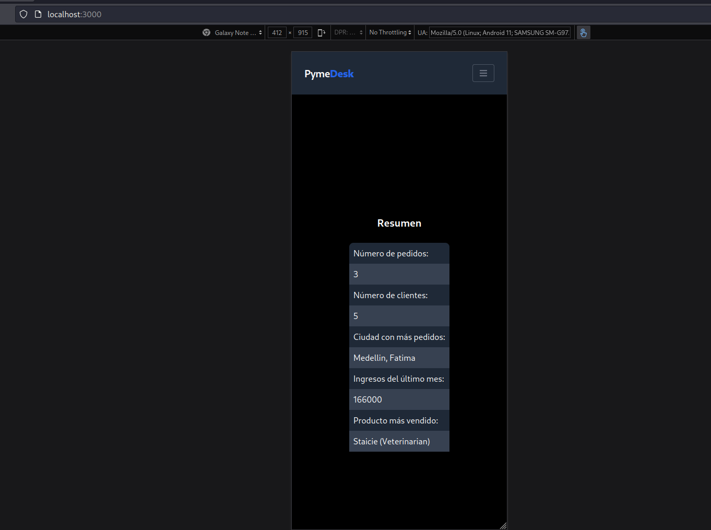
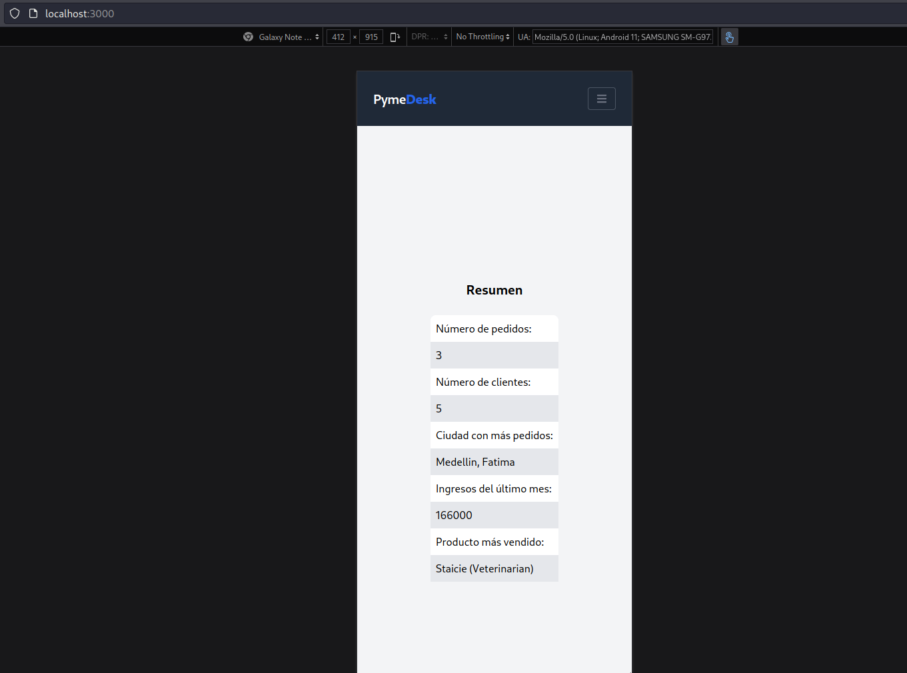
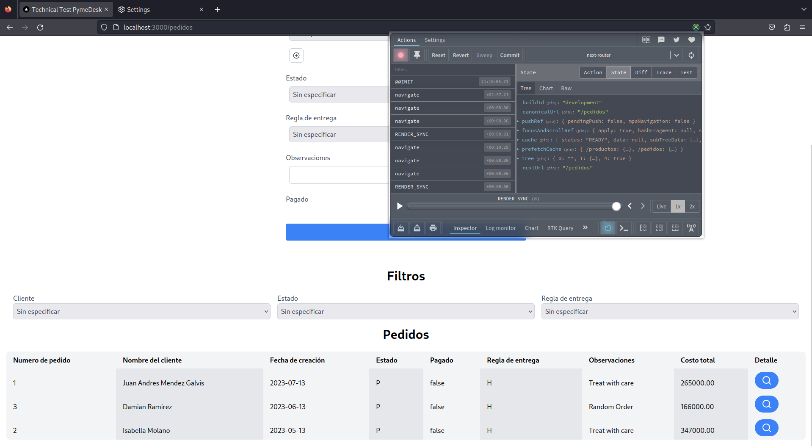
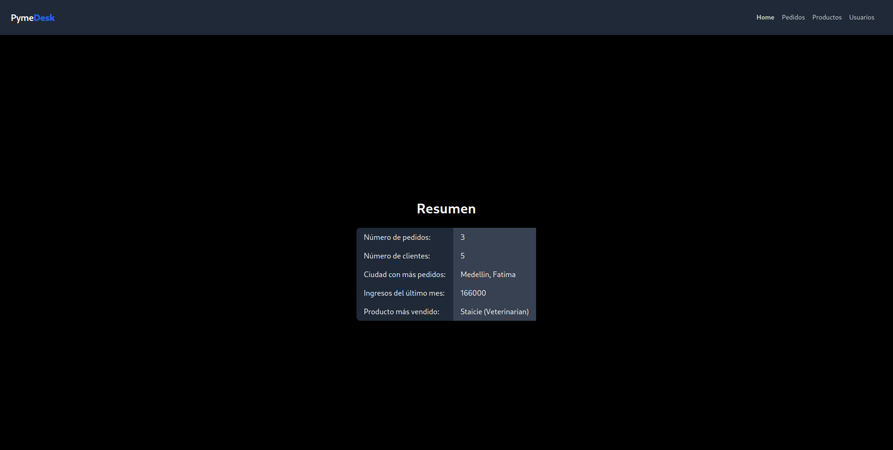

# PymeDesk Technical Interview 

PymeDesk Technical Interview is a full-stack application built with the latest Next.js 13, utilizing its new appRouter for seamless navigation and better user experience. This application showcases a range of modern features such as responsiveness across all device types, an intuitive dark mode for enhanced usability, and robust state management using Redux toolkit. The application uses the Airbnb JavaScript style guide, providing clean, maintainable code that adheres to some of the best practices in the industry.



* **Responsive Design**: The application has a responsive layout, which means it provides an optimal viewing and interaction experience across a wide range of devices—from desktop computer monitors to mobile phones.



* **Dark Mode**: With increased focus on accessibility and user experience, the application incorporates a dark mode. This not only reduces eye strain in low-light conditions, but it also conserves battery power on OLED screens.



* **Redux Toolkit**: Redux Toolkit is used for efficient state management in this application. It helps write more efficient, easy-to-understand Redux code.

## Installation

Before running the project, install the dependencies using npm. Due to the Airbnb linter, it's important to use the `--legacy-peer-deps` option when installing.

```bash
npm install --legacy-peer-deps
```

## Getting Started

After installation, run the development server:

```bash
npm run dev
# or
yarn dev
# or
pnpm dev
```

Open [http://localhost:3000](http://localhost:3000) with your browser to see the result.

You can start editing the page by modifying `app/page.tsx`. The page auto-updates as you edit the file.

## Deployment on Vercel

The easiest way to deploy your Next.js app is to use the [Vercel Platform](https://vercel.com/new?utm_medium=default-template&filter=next.js&utm_source=create-next-app&utm_campaign=create-next-app-readme) from the creators of Next.js.

Check out the [Next.js deployment documentation](https://nextjs.org/docs/deployment) for more details.

## Built with Next.js 13 and AppRouter

This application is built with the latest Next.js 13, utilizing the new AppRouter. It's the next step in the framework that allows for faster and more efficient routing. 



The application also uses Tailwind CSS for its design system, providing low-level utility classes that let you build completely custom designs.
